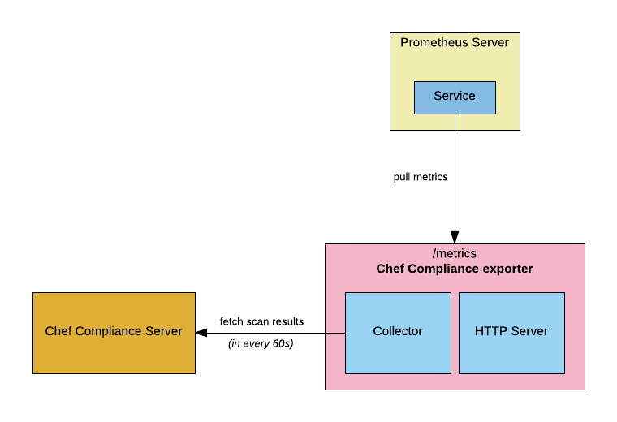

# Chef Compliance Prometheus Exporter

A [Prometheus][prometheus] exporter for [Chef Compliance][chef_compliance] metrics. 
## Architecture overview



## Installation

### Docker

Easiest way to run the metrics is via Docker image.

```bash
# docker run -d -p 9243:9243              \
  -e API_URL=<chef_compliance_url>        \
  -e PORT=9243                            \
  -e REFRESH_TOKEN=<your_refresh_token>   \
  -e COMPLIANCE_USERNAME=<your_chef_user> \
  --name chef_compliance_metrics          \
  eerkunt/prometheus_chef_compliance_exporter:0.1.0
```
Then add a new [Prometheus][prometheus] target by changing prometheus.yml file ;

```yml
scrape_configs:
  - job_name: Chef Compliance Metrics
    static_configs:
      - targets: [ 'localhost:9243' ]
```
Please note that we run the docker container within the same host in Prometheus in this example. Change `localhost` in the above config to wherever you run the container.

### Direct

You picked the hard way, that is fine.

Clone the repository ;

```bash
# git clone https://github.com/eerkunt/chef_compliance_exporter
# cd chef_compliance_exporter
```

(OPTIONAL) Create a virtual python environment ;

```bash
# virtualenv venv
# source venv/bin/activate
```

Install required packages ;

```bash
# pip install -r requirements.txt
```

Then run the exporter ;

```bash
# PORT=9243 API_URL=<chef_compliance_url> \
  REFRESH_TOKEN=<your_refresh_token>      \
  COMPLIANCE_USERNAME=<your_chef_user>    \
  nohup python chef_compliance.exporter.py
```

Then add a new [Prometheus][prometheus] target by changing prometheus.yml file ;

```yml
scrape_configs:
  - job_name: Chef Compliance Metrics
    static_configs:
      - targets: [ 'localhost:9243' ]
```

Please note that we run the exporter within the same host in Prometheus in this example. Change `localhost` in the above config to wherever you run the exporter.

## Usage

### Environment Variables

| Environment Variable | Required | Default | Description |
| --------------------------- | -------- | ------- | ----------- |
| `API_URL` | Yes | | URL of Chef Compliance Server |
| `PORT`| Yes | 9243 | Metrics server port |
| `REFRESH_TOKEN`| *[1]* Yes | | Refresh token that is needed to auth Chef Compliance Server |
| `SLEEP_DURATION` | No | 60 | Duration between to fetch metrics from Chef Compliance Server<br />Curious about why we need this ? Please refer to [FAQ][faq] |
| `COMPLIANCE_USERNAME` | No | `chef_compliance_exporter` | The username that is used in Chef Compliance |
| `COMPLIANCE_ENVIRONMENT` | No | `default` | The environment that is used in Chef Compliance Scans |

*[1]* `REFRESH_TOKEN`s are permanent to generate Auth Tokens for Chef Compliance Server. In order to find out your `REFRESH_TOKEN` please follow [API Documentation](https://docs.chef.io/api_compliance.html).

### Metrics

The exporter returns the following metrics:

| Metric | Description | Labels |
| ------ | ----------- | ------ |
| *compliance_scanned_node_count* | Total number of nodes that are scanned in Chef Compliance |  |
| *compliance_scan_result* | Compliance Scan Results | `hostname`, `severity` |
| *compliance_scan_patchlevel* | Patch-level Scan Results | `hostname`, `severity` |

## Contributing

Refer to the [contributing guidelines][contributing].

## License

MIT License, see [LICENSE][license].

[chef_compliance]: https://docs.chef.io/compliance.html
[contributing]: https://github.com/contino/chef_compliance_exporter/blob/master/CONTRIBUTE.md
[license]: https://github.com/contino/chef_compliance_exporter/blob/master/LICENSE
[faq]: https://github.com/contino/chef_compliance_exporter/blob/master/FAQ.md
[prometheus]: https://prometheus.io/
